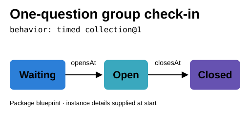
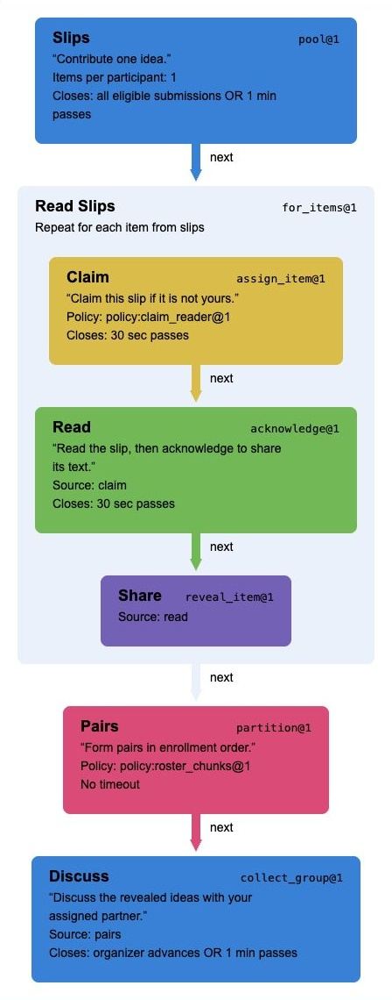
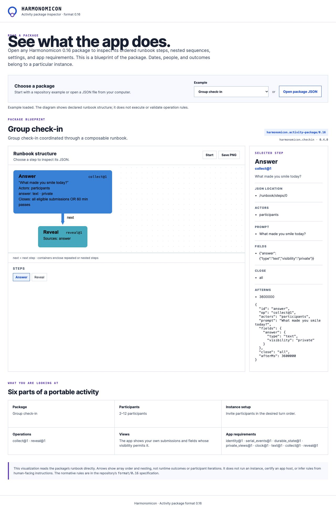
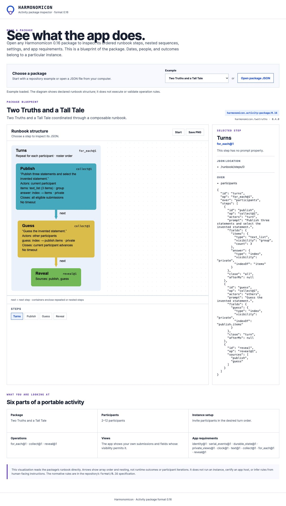

# Harmonomicon

Harmonomicon aims to provide an expressive activity language and runtime so a host app can support many user-authored group activities. Authors can compose reusable steps and adjust their settings to create different activities within the app. An **activity package** describes what to show, when people can act, what each person can see, and how the activity moves from one step to the next.

The primary goal is in-app composability: new arrangements of supported operations should require activity data rather than new app code. Running packages across different apps is a secondary potential benefit; demand for cross-platform portability is uncertain. Independent implementations remain useful evidence that the rules are explicit and reproducible. [App integration and prompting](research/app-integration-and-prompting.md) records possible directions and unresolved choices.

Think of an icebreaker in a group chat, a collaborative drawing game on a website, or a daily creative prompt sent by an app. The app might send a prompt, collect contributions, pass a turn, or reveal a result. An activity package puts those instructions and rules together so they can be reused.

Each activity has its own package. Some packages need only a prompt and a timer; others need private submissions, assignments, and a record of what happened. People may step away from the app to take a photo or make something. The package describes the digital steps around that work: the prompt, submission, deadline, and sharing.

**Current candidate:** [0.21](format/0.21/README.md) adds contribution-backed voting, optional vote changes, private ballots with separately presented totals, structured outcomes/tie policies and explicit finite linked rounds. It retains 0.20 typed exchange and host controls. The [supported profile](format/0.21/readiness-assessment.md) and [prospective host app review packet](format/0.21/HOST-REVIEW.md) distinguish core adoption support from product parity. Host accounts, calendars, media and notifications remain external; no 1.0 decision is implied. The package inspector and illustrative sections below remain pinned to the retained 0.20 catalog.

## A simple example: one question for a group

Imagine an organizer starts a check-in for eight people in an app. At the start, the app asks everyone, “What made you smile today?” Each person can send one text answer. Answers stay private while people write. When everybody has answered, or an hour has passed, the app shows the answers to the group.

The package would describe the activity in terms like these:

| Part | What this activity says |
|---|---|
| Who takes part | The organizer and the invited participants |
| What people do | Answer one question with text |
| When it happens | Start at the chosen time; reveal when everyone answers or after one hour |
| Who can see what | A participant sees their own answer before the reveal; everyone sees the answers afterward |
| What happens if someone misses it | The reveal still happens after one hour |

The runbook has two steps: **collect answers**, then **reveal answers**. The collection step defines who can answer, what an answer looks like, its privacy, and when collection ends. The reveal step makes those answers visible. Another app can run the same [0.20 package](format/0.20/examples/check-in.json) if it supports those operations.

## A richer example: Pooled ideas followed by pair discussion

Imagine a group of eight people gathering ideas before discussing them in pairs. Each person contributes one idea to a shared pool. Participants take turns claiming and reading ideas from other people, then discuss the shared ideas with an assigned partner.

The [Pooled ideas followed by pair discussion package](format/0.20/examples/pooled-ideas-and-pairs.json) combines these steps:

1. **Pool ideas:** each participant contributes one text idea. Collection closes when everyone has contributed or one minute has passed. The app withholds pooled authorship metadata.
2. **Read and share each idea:** for each pooled item, a participant can claim it if it is not their own. The reader acknowledges reading it, then the app reveals its text. Claiming and reading each have a 30-second timeout.
3. **Form pairs:** the app groups participants in enrollment order, with two people per pair.
4. **Discuss privately:** partners discuss the revealed ideas in their assigned group. This step closes when the organizer advances or one minute has passed; responses are visible within the recorded pair membership.

The runbook composes an idea pool, a repeated claim/read/share sequence, pair assignment, and private group collection. The package declares the ordering, assignment policies, visibility, and closing rules; an app host implements those reusable operations. This combination is supported by candidate 0.20 and exercised in the [local trial](validation/0.20/README.md).

## What goes in a package?

An activity package brings together:

- **Directions for people:** what the activity is, how to join, and what to do at each step.
- **Settings:** prompts, participant limits, and timing for the app to use.
- **Roles and actions:** who may submit, whose turn it is, and who can see the reveal.
- **Timing and visibility:** when actions are allowed and who can see each contribution.
- **Rules for interruptions:** what happens when someone is late, absent, or retries. Each step states how it ends and what happens to missing contributions.
- **App requirements:** features such as a clock, private views, or support for particular media.
- **Example runs:** sample actions and expected results that an app can use to check its implementation.

The app that runs a package is called an **app host**. It provides accounts, storage, scheduling, messages, and screens. It also executes the steps the package declares. The app host must say when it cannot provide a required feature or rule. Apps can be written in different programming languages and still use the same package when they implement the same behavior.

## Candidate 0.20 format

A package now contains a **runbook**: an ordered list of steps. Each step names an operation and supplies its settings. The package decides the sequence; the app implements the reusable operations.

For example, the [Two Truths package](format/0.20/examples/two-truths.json) repeats three steps for each speaker: collect visible statements with a private answer, collect private guesses from everybody else, and reveal the answer and guesses when the speaker advances. The [List Game package](format/0.20/examples/list-game.json) uses the same operations with five items and text guesses. A [poll](format/0.20/examples/choice-poll.json) uses collection, reveal, and counting. A [prompted routine](format/0.20/examples/see-think-wonder.json) uses three collections that the organizer advances. A [timed story](format/0.20/examples/timed-story.json) repeats a text-append step for each participant.

The [authoring guide](format/0.20/authoring.md) shows how these packages are written. The [specification](format/0.20/README.md), [schema](format/0.20/package.schema.json), and [operation rules](format/0.20/operations.md) define what an app must do. The [conformance cases](format/0.20/conformance/README.md) are sample actions and expected results that check an implementation.

In the [local trial](validation/0.20/README.md), separate Python and Node.js apps run the same composed packages with their own databases. The trial also creates a new package that performs a check-in followed by a story relay, transfers it between the apps, and runs it without changing either interpreter. The trial also transfers a new pooled-ideas-then-pairs arrangement. Tests check private group history, competing item IDs and reader claims, deadlines, retries, and restart.

New packages add a [two-item gratitude pool](format/0.20/examples/gratitude-pool.json), [changing partner rounds](format/0.20/examples/partner-rounds.json), [timed solo/pair/quartet rounds](format/0.20/examples/one-two-four-all.json), and [pooled ideas followed by paired reflection](format/0.20/examples/pooled-ideas-and-pairs.json). The package states how items are ordered and how groups are chosen; it does not infer those rules from instructions.

The [migration checklist](format/0.20/MIGRATION.md) accounts for all twenty earlier examples. It records available steps and missing rules; the scheduled text check-in, three text daily-practice activities, image check-in and image daily prompt are complete migrations, with fourteen remaining. Twenty-six current runbook examples demonstrate selected digital activities, rather than all earlier functionality.

The [earlier 0.12 candidate](format/0.12/README.md) contains ten complete activity behaviors and PNG support. Its richer examples remain useful for testing which rules the runbook needs next. Support for one candidate does not imply support for the other.

A [scheduled check-in](format/0.20/examples/scheduled-check-in.json) keeps collection open until a chosen closing time, even when everyone answers early. Its package declares opening time, closing time, and question settings for the organizer to choose when starting it. The app validates and saves those choices. Another [package](format/0.20/examples/scheduled-check-in-pairs.json) follows the reveal with private paired reflection using the same scheduling rules.

A [proposal assessment](format/0.20/examples/proposal-assessment.json) shows another combination: collect ideas, assign each idea to two different reviewers, collect private 0–10 ratings, publish ranked totals, then invite private paired reflection. The package states the routing rule, score calculation, and what happens if a reviewer misses a deadline. Individual ratings stay private even after totals appear. A [25/10 digital translation](format/0.20/examples/crowd-scoring.json) uses five rounds and exact scaled averages; its [notes](format/0.20/scoring-notes.md) explain the digital choices.

Three daily-practice packages retain [private entries](format/0.20/examples/daily-private-practice.json), [reveal at closing](format/0.20/examples/daily-reveal.json), or [immediate group sharing](format/0.20/examples/daily-shared-prompt.json). Each uses explicit fixed windows and public completion status. A [repeated poll and pairs](format/0.20/examples/repeated-poll-and-pairs.json) combines the same schedule with choice tallies and later pair-private reflection. Fixed intervals do not follow local calendar dates or imply notification delivery.

A [single-source creative response](format/0.20/examples/single-source-creative-response.json) assigns each contributor one randomized non-self text source, saves the assignment, and collects an independent linked response. An [idea exchange and pairs](format/0.20/examples/idea-response-and-pairs.json) uses a deterministic next-contributor policy and continues into private paired reflection. Both declare one-source cardinality, reuse and unmatched behavior explicitly. These are simplified activities; [distribution notes](format/0.20/distribution-notes.md) distinguish them from faithful Chorus or two-offer legacy behavior.

A [simplified Chorus](format/0.20/examples/simplified-chorus.json) carries image identity into saved random non-self assignment and independent text/audio response. [Feedback Round](format/0.20/examples/feedback-round.json) exposes primary pieces immediately while open replies remain with the host; [daily music journal](format/0.20/examples/daily-music-journal.json) uses solo host-dated instances. Effective actors and multi-day dates are trusted host inputs, with exact runtime eligibility/visibility/deadline rules. These examples do not claim faithful product parity.

## Package inspector

**[Open the live Runbook Structure diagrammer](https://canted.github.io/harmonomicon/)**

The [activity package inspector](docs/README.md) renders candidate 0.20 runbooks directly from their JSON. It lists all current examples and can open another package file locally. Select a step to see its operation and settings. Arrows show declared sequence and nesting; the viewer does not simulate an activity. Generated SVG diagrams display in this repository. Use the [live diagrammer](https://canted.github.io/harmonomicon/) in your browser, or follow the [local setup instructions](docs/README.md#run-locally). The live site is published from `docs/` on the repository’s default branch.

### Runbook Structure screenshots

**Group check-in:** collect private answers, then reveal them to the group.

**Two Truths and a Tall Tale:** a participant loop encloses Publish, Guess, and Reveal. The container declares repetition without expanding each participant’s turn.

## Roadmap

The [format roadmap](ROADMAP.md) records candidate evidence, proposed readiness criteria, and a user review checkpoint before any 1.0 decision. The [coverage audit](COVERAGE.md) maps the research examples to current rules and remaining gaps.

## Research

- [Activity cards](research/activities/) describe individual activities, including offline practices studied for possible digital adaptations. The [card template](research/activity-card-template.md) shows what each description records.
- [Breadth survey](research/breadth-survey.md) maps group activities from many settings as source material for digital versions.
- [Mechanism survey](research/mechanism-survey.md) compares recurring rules such as turns, assignments, deadlines, and reveals.
- [Digital activity cases](research/digital-activity-stress-cases.md) examine queues, missed turns, and complex rules run by software.
- [Game jams and shared creative practice](research/creative-jams-and-shared-practice.md) cover group projects, journaling, and recurring prompts.
- [Portable activity packages](research/portable-activity-packages.md) and [contract synthesis](research/contract-synthesis.md) record the open design questions and the current direction.

## Experiments

- [First contract experiment](experiments/README.md) defines several unlike activities and checks their behavior in JavaScript and Python; its [findings](experiments/findings.md) explain the limits.
- [Named mechanisms](experiments/named-mechanisms/README.md) test compact rules for handoffs and collections.
- [Offer flows](experiments/offer-flows/README.md) test a two-person relay and Cover and Response, including deadlines, retries, and saved offers.
- [Composition](experiments/composition/README.md) tests whether shared operations can describe different activities.
- [Creative-practice revisit](experiments/creative-practice-revisit/README.md) checks the earlier experiments against game-jam and journaling cases.
- [Ongoing activities](experiments/ongoing-activities/README.md) test project progress and repeated private or public practice.
- [Assignment-policy portability](experiments/policy-portability/README.md) specifies one offer rule precisely and checks it in JavaScript, Python, and Ruby.
- [Simple digital pattern audit](experiments/format-0.12-coverage-challenge/README.md) tries eight source-backed procedures against format 0.12, including exact failure witnesses and a runnable timed-room package.
- [Hidden-answer comparison](experiments/hidden-answer-composition/README.md) tests a narrow contract and reusable operations on Two Truths and a Tall Tale, then checks reuse on List Game.
