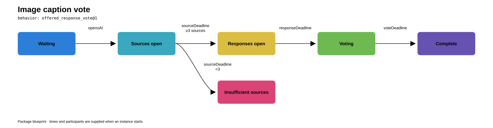

# Harmonomicon

Harmonomicon describes a common format for group activities coordinated by software. An **activity package** describes one activity so different apps can run it. It tells the app what to show, when people can act, what each person can see, and how the activity moves from one step to the next.

Think of an icebreaker in a group chat, a collaborative drawing game on a website, or a daily creative prompt sent by an app. The app might send a prompt, collect contributions, pass a turn, or reveal a result. An activity package puts those instructions and rules together so they can be reused.

Each activity has its own package. Some packages need only a prompt and a timer; others need private submissions, assignments, and a record of what happened. People may step away from the app to take a photo or make something. The package describes the digital steps around that work: the prompt, submission, deadline, and sharing.

## A simple example: one question for a group

Imagine an organizer starts a check-in for eight people in an app. At the start, the app asks everyone, “What made you smile today?” Each person can send one text answer. Answers stay private while people write. At 7 p.m., the app shows the answers to the group, even if some people did not reply.

The package would describe the activity in terms like these:

| Part | What this activity says |
|---|---|
| Who takes part | The organizer and the invited participants |
| What people do | Answer one question with text |
| When it happens | Start at the chosen time; reveal at 7 p.m. |
| Who can see what | A participant sees their own answer before the reveal; everyone sees the answers afterward |
| What happens if someone misses it | The reveal still happens at 7 p.m. |

An app running the package would show the prompt, accept answers, keep them private, watch the deadline, and reveal them. Another app could run the same package if it supports those rules. A [0.12 package](format/0.12/examples/group-check-in.json) describes this check-in.

## A richer example: image caption contest

Imagine a group caption contest run in an app. Instead of everyone captioning the same picture, participants first upload several images. The app then gives each image contributor two images uploaded by other people. They choose one and write a caption. More than one person may caption the same image.

The activity has a few stages:

1. Participants upload one image each before the image deadline.
2. After the image deadline, if at least three images are available, the app offers each contributor two images from other people. It favors images that have been offered fewer times.
3. Each contributor chooses one offered image and submits a caption. Captions stay private during this stage.
4. At the caption deadline, the app reveals the image-caption pairs. Participants vote for a caption by someone else; the app shows totals and any tied winners when voting closes.

The package says when each stage starts and ends, how the app chooses image offers, who can see captions before the reveal, and how votes are counted. It also says what happens if fewer than three images arrive or someone never submits a caption. In format 0.12, fewer than three images ends the activity without a group reveal; missing captions do not delay the deadline. A later contract could define a different recovery rule. Repeated requests for an offer should return the same two images, so a participant does not get a new choice by refreshing the screen.

The [0.12 image-caption vote package](format/0.12/examples/image-caption-vote.json) defines image collection, two-source offers, linked text captions, voting, and a result. Both local validation app hosts run it with stored PNG images and audience-controlled access.

Other packages could describe a hidden drawing handoff in a browser, a recurring photo challenge, or an online game jam with progress posts and a final submission window. The activity package covers what the app asks, records, assigns, and shares, even when participants make something away from the screen.

## What goes in a package?

An activity package brings together:

- **Directions for people:** what the activity is, how to join, and what to do at each step.
- **Settings:** details an organizer can choose, such as a prompt, group size, or deadline.
- **Roles and actions:** who may submit, whose turn it is, and who can see the reveal.
- **Timing and visibility:** when actions are allowed and who can see each contribution.
- **Rules for interruptions:** what happens when someone is late, absent, or retries. Other responses to interruption can be added through later behavior contracts.
- **App requirements:** features such as a clock, private views, or support for particular media.
- **Example runs:** sample actions and expected results that an app can use to check its implementation.

The app that runs a package is called an **app host**. It provides accounts, storage, scheduling, messages, and screens. It also carries out the rules the package names. The app host must say when it cannot provide a required feature or rule. Apps can be written in different programming languages and still use the same package when they implement the same behavior.

## Format 0.12

The [candidate 0.12 format](format/0.12/README.md) describes each activity in JSON: directions for people, participation limits, source and rights information, app features it needs, and a named set of rules for the app host to run. The [package schema](format/0.12/package.schema.json) describes the structure; the [behavior contracts](format/0.12/contracts.md) and [image rules](format/0.12/media.md) define what an app host does. An app host checks exact rule and feature versions before starting an activity.

It defines ten sets of rules. **Timed collection** gathers private submissions for a deadline reveal. **Sequential handoff** passes a contribution to the next participant. **Repeated collection** runs a fixed series of windows. **Offered response** gives contributors two sources to choose from before they respond. **Project cycle** lets fixed teams share progress, submit final work, and review one another. **Ongoing space** keeps a shared notebook or prompt series with private entries, comments, and optional completion status. **Guided rounds** run timed prompts with changing participant groups and clear rules for when each group's text becomes visible. **Competitive handoff** offers each turn to two people, accepts the first response, and falls back after a decline or timeout. **Offered response vote** adds a voting window and exact result rules to a source-and-response activity. **Permissioned dialogue** lets a facilitator advance stages and lets a maker approve or decline each request for an opinion. The [group check-in](format/0.12/examples/group-check-in.json), [Pass a line](format/0.12/examples/pass-a-line.json), [private daily writing circle](format/0.12/examples/daily-private-practice.json), [paired story response](format/0.12/examples/paired-story-response.json), [small team jam](format/0.12/examples/small-team-jam.json), [shared notebook](format/0.12/examples/shared-notebook.json), [small group synthesis](format/0.12/examples/small-group-synthesis.json), and [two-offer story chain](format/0.12/examples/two-offer-story-chain.json), [image caption vote](format/0.12/examples/image-caption-vote.json), and [feedback circle](format/0.12/examples/feedback-circle.json) are example packages.

Images can be stored as content-hash references that the app host authorizes when someone reads the bytes. Packages can move between apps. An app host can import a package, report the rule and feature versions it supports, and export the same package for another app host. The activity's ID and version identify its content; changing that content requires a new version. The package contains data rather than code tied to one server language.

The [conformance cases](format/0.12/conformance/README.md) give sample actions and expected participant views. The [local trial with two app hosts](validation/0.12/README.md) imported the same text and image packages into independent Python and Node.js services, ran all 41 cases, and transferred a newly authored package between them. Image support currently covers a bounded PNG subset. The local trial does not cover other media types, notifications, human judgment of feedback, multi-criterion ratings, migration of an activity in progress, or public deployment.

## Package inspector

The [activity package inspector](docs/README.md) renders a 0.12 package as an interactive diagram. It ships with these two examples and can open another package JSON file locally. The static diagrams above display directly in this repository. To use the interactive viewer, serve `docs/` locally or publish it through GitHub Pages; the repository file view does not run its JavaScript.

## Roadmap

The [format roadmap](ROADMAP.md) records the candidate evidence and the candidate 0.12 validation. The [coverage audit](COVERAGE.md) maps the research examples to current rules and remaining gaps.

## Research

- [Activity cards](research/activities/) describe individual activities, including offline practices studied for possible digital adaptations. The [card template](research/activity-card-template.md) shows what each description records.
- [Breadth survey](research/breadth-survey.md) maps group activities from many settings as source material for digital versions.
- [Mechanism survey](research/mechanism-survey.md) compares recurring rules such as turns, assignments, deadlines, and reveals.
- [Digital activity cases](research/digital-activity-stress-cases.md) examine queues, missed turns, and complex rules run by software.
- [Game jams and shared creative practice](research/creative-jams-and-shared-practice.md) cover group projects, journaling, and recurring prompts.
- [Portable activity packages](research/portable-activity-packages.md) and [contract synthesis](research/contract-synthesis.md) record the open design questions and the current direction.

## Experiments

- [First contract experiment](experiments/README.md) defines several unlike activities and checks their behavior in JavaScript and Python; its [findings](experiments/findings.md) explain the limits.
- [Named mechanisms](experiments/named-mechanisms/README.md) test compact rules for handoffs and collections.
- [Offer flows](experiments/offer-flows/README.md) test a two-person relay and Cover and Response, including deadlines, retries, and saved offers.
- [Composition](experiments/composition/README.md) tests whether shared operations can describe different activities.
- [Creative-practice revisit](experiments/creative-practice-revisit/README.md) checks the earlier experiments against game-jam and journaling cases.
- [Ongoing activities](experiments/ongoing-activities/README.md) test project progress and repeated private or public practice.
- [Assignment-policy portability](experiments/policy-portability/README.md) specifies one offer rule precisely and checks it in JavaScript, Python, and Ruby.
- [Simple digital pattern audit](experiments/format-0.12-coverage-challenge/README.md) tries eight source-backed procedures against format 0.12, including exact failure witnesses and a runnable timed-room package.
- [Hidden-answer comparison](experiments/hidden-answer-composition/README.md) tests a narrow contract and reusable operations on Two Truths and a Tall Tale, then checks reuse on List Game.
